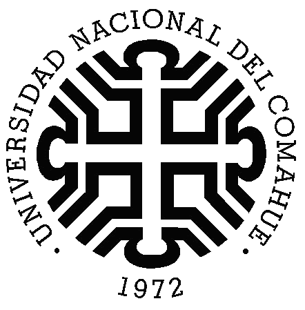

---

### El lenguaje Python

 * Lenguaje de programación multipropósito y multiplataforma
    * Muy versátil, apto para aplicaciones de escritorio, de servidor y/o aplicaciones web
    * Independiente del sistema operativo

---

### El lenguaje Python

 * Creado por el holandés Guido Van Rossum a fines de la década de 1980
    * Previsto para inetractuar el sistema operativo _amoeba_
        * Un sistema de tiempo compartido que hiciera que una red entera de computadoras pareciera a los ojos de un usuario como una máquina única
        * Actualmente el desarrollo de ese sistema operativo parece detenido

---

### Caracerísticas de Python

 * Es un lenguaje de alto nivel
    * Se asemeja al lenguaje humano, con una sintaxis semejante al idioma inglés
        * Una persona que domine el idioma inglés, podrá deducir qué hace un programa escrito en python aún sin saber programar.

---

### Caracerísticas de Python

 * Posée una gramática clara y legible extremadamente fácil de aprender
     * Prescinde de símbolos especiales (punto y coma al final de cada sentencia, etc)
     * La curva de aprendizaje del lenguaje es empinada (en poco tiempo se aprende mucho)

---

### Caracerísticas de Python

 * Es interactivo
     * Se puede modificar un programa mientras éste se encuentra activo
     * Los programas interactivos durante su ejecución pueden leer datos del teclado y escribir resultados en la pantalla

---

### Caracerísticas de Python

 * Es un lenguaje interpretado
     * El código no necesita ser preprocesado por un compilador
     * Cada instrucción se traduce a lenguaje máquina y - si no se detectan errores - se ejecuta inmediatamente

---

### Caracerísticas de Python

 * Es fuertemente tipado
    * Distingue claramente el tipo de la variable (entera, carácter, etc)
    * Si se pretende utilizar una variable de un determinado tipo cuando debe ser de otro, se produce un error

---

### Caracerísticas de Python

 * El tipado es dinámico
    * Se establece el tipo de una variable de manera dinámica, es decir, en tiempo de ejecución
    * No es necesario declarar previamente el tipo de la variable.
 
---

### Caracerísticas de Python

 * Lenguaje orientado a objetos
    * Paradigma de programación que usa objetos y sus interacciones
    * Los objetos son entidades que combinan estado (atributo), comportamiento (método) e identidad
 * Posée un conjunto de implementaciones (_biblioteca_) estándar muy amplia
    *  Contiene módulos (escritos en lenguaje C) que proporcionan acceso a las funcionalidades propias del sistema operativo

---

### Código fuente y bytcode

 * Si bien Python es un lenguaje interpretado, el intérprete genera archivos binarios que son los que se ejecutan
    * Este proceso se realiza de manera transparente a partir de los archivos fuente _.py_ y el código generado se conoce como _bytcode_ y utiliza la extensión _.pyc_
    * El programador no interviene en el proceso
    * El intérprete de Python lee el archivo fuente, genera el _bytcode_ y lo ejecuta, aumentando la velocidad y eficiencia en la ejecución
    * Una vez generado el archivo _.pyc_, Python no vuelve a leer el archivo fuente, salvo que este último haya cambiando

---

### Ejemplo

```{python}
x = 'hola mundo python'
print(x.split(' '))

```
---
